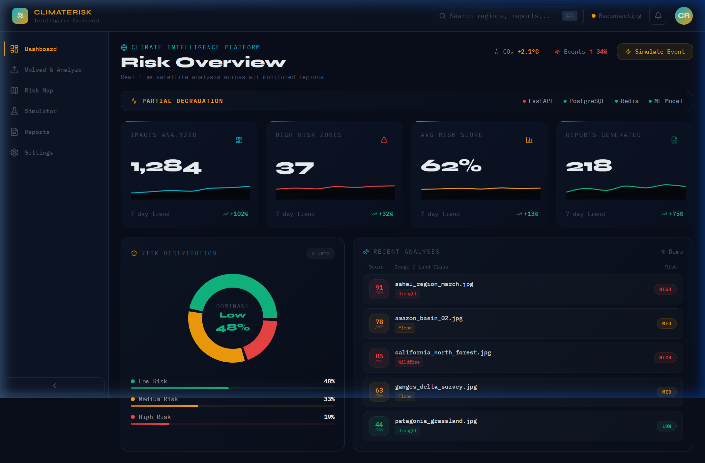
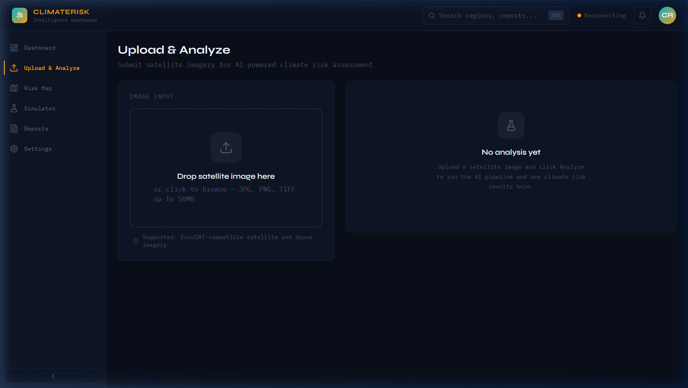
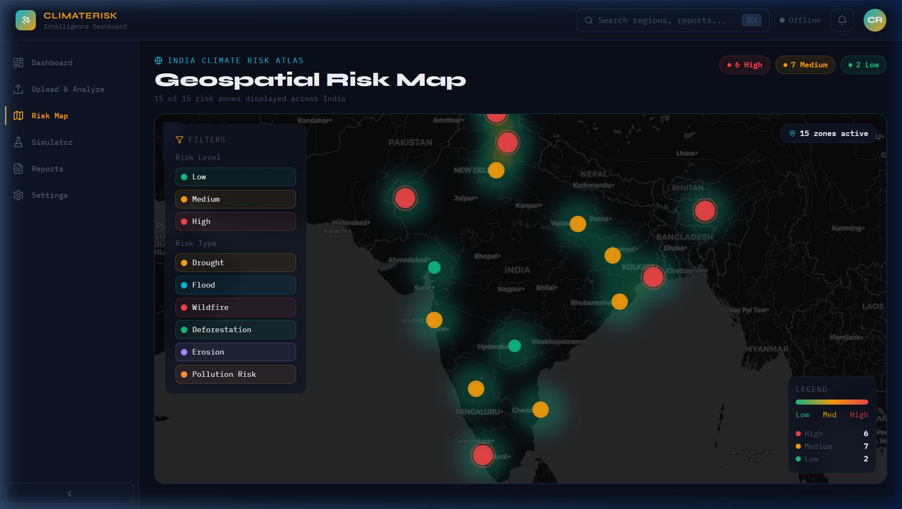
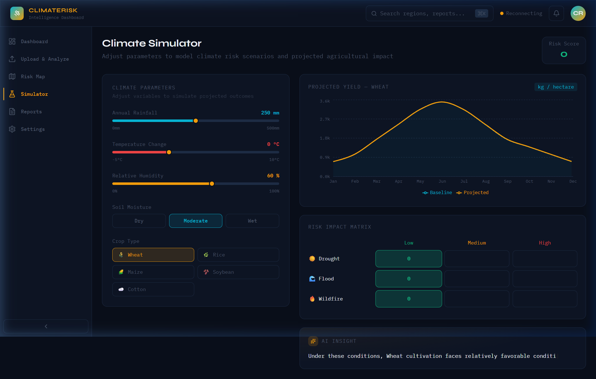
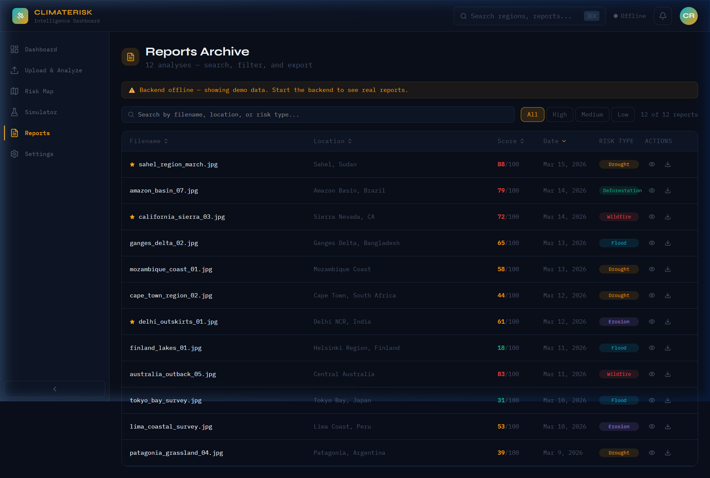
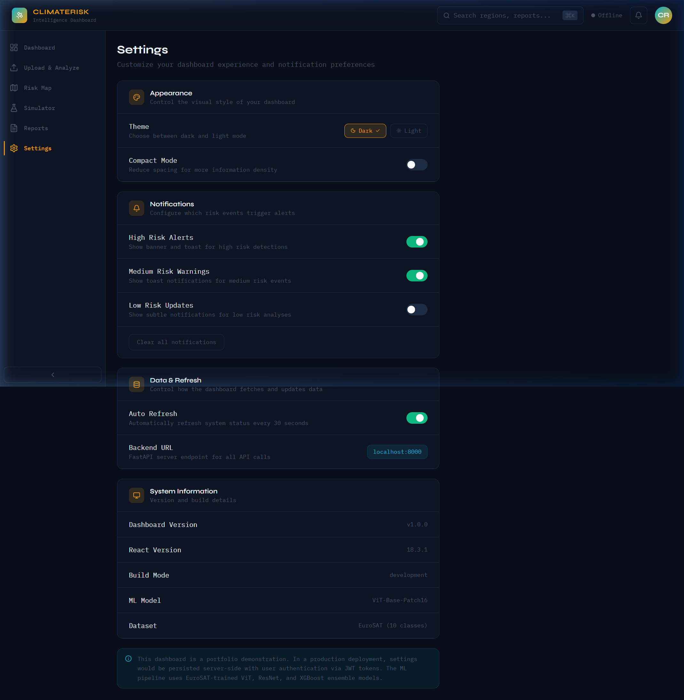

# 🌍 Climate Risk Intelligence System

<div align="center">



<br/>

**An AI-powered platform for real-time climate risk analysis using satellite imagery, Vision Transformers, and LLM-driven assessment.**

<br/>

[](https://react.dev/)
[](https://www.typescriptlang.org/)
[](https://fastapi.tiangolo.com/)
[](https://www.python.org/)
[](https://postgresql.org/)
[](https://redis.io/)
[](LICENSE)

</div>

---

## 📋 Table of Contents

- [Overview](#-overview)
- [Screenshots](#-screenshots)
- [Features](#-features)
- [Architecture](#-architecture)
- [Tech Stack](#-tech-stack)
- [Prerequisites](#-prerequisites)
- [Installation](#-installation)
- [Running the Application](#-running-the-application)
- [API Documentation](#-api-documentation)
- [Project Structure](#-project-structure)
- [Deployment](#-deployment)
- [Development](#-development)
- [Contributing](#-contributing)
- [License](#-license)

---

## 🎯 Overview

The **Climate Risk Intelligence System** is a full-stack, production-ready platform that combines cutting-edge AI and geospatial intelligence to help organizations assess and respond to climate-related risks across geographic regions.

At its core, the system leverages:

- **Vision Transformer (ViT-Base-Patch16)** models trained on EuroSAT satellite imagery for land classification
- **Google Gemini LLM / LangChain agents** for contextual risk evaluation and narrative report generation
- **Interactive geospatial mapping** with real-time risk zone visualization (Leaflet.js)
- **Climate simulation engine** for scenario modeling and agricultural impact forecasting
- **WebSocket-driven live updates** so results appear in real time on the dashboard

This system enables analysts, researchers, and organizations to make data-driven decisions about climate hazards — from drought and flood detection to wildfire prediction and deforestation monitoring.

---

## 📸 Screenshots

### 1. Risk Overview Dashboard

> Real-time KPI cards, risk distribution donut chart, and recent analyses activity feed.


---

### 2. Upload & Analyze

> Drag-and-drop satellite image upload interface with live AI analysis results panel.



---

### 3. Geospatial Risk Map

> India Climate Risk Atlas — interactive Leaflet map with filterable risk zones, heatmap overlays, and a live legend.



---

### 4. Climate Simulator

> Parameterized climate scenario tool — adjust rainfall, temperature, humidity and crop type to project agricultural yield and risk impact matrix.



---

### 5. Reports Archive

> Searchable and filterable archive of all generated analysis reports with risk-type badges and export actions.



---

### 6. Settings

> Dashboard appearance, notification preferences, data refresh configuration, and system information panel.



---

## ✨ Features

### 🛰️ Core Capabilities
| Feature | Description |
|---------|-------------|
| **Satellite Image Analysis** | Upload EuroSAT-compatible satellite or drone imagery (JPG, PNG, TIFF, up to 50 MB) |
| **ViT Classification** | Vision Transformer (ViT-Base-Patch16) classifies land types: drought, flood, wildfire, deforestation, erosion, pollution |
| **LLM Risk Assessment** | Google Gemini 1.5 Flash / Pro generates nuanced, human-readable risk reports with mitigation recommendations |
| **Geospatial Mapping** | Leaflet.js interactive map with colour-coded risk zone markers and filters |
| **Climate Simulation** | Parameter sliders (rainfall, temp, humidity, soil) produce projected crop yield curves and a risk impact matrix |
| **Report Archive** | Filterable table of all analyses with starred favourites, search, and PDF export |
| **Real-time Updates** | WebSocket (Socket.io) pipeline pushes analysis progress and live KPI updates to the dashboard |
| **Vector Search** | pgvector integration enables semantic similarity search across historical analyses |

### 🎨 User Interface
- Sleek **dark-mode** design with a climate-themed colour palette and glassmorphism cards
- Animated KPI cards with 7-day micro-trend sparklines
- Framer Motion page transitions and micro-interactions
- Collapsible sidebar navigation for more screen real estate
- Toast notifications for system events and analysis completions

### ⚙️ Backend Services
- **FastAPI** async REST API with Pydantic validation
- **Celery** distributed task queue for non-blocking image processing
- **PostgreSQL 15** with **pgvector** for vector embeddings
- **Redis 7** for caching and Celery broker
- **Socket.io** bidirectional real-time communication

---

## 🏗️ Architecture

```
┌──────────────────────────────────────────────────────────────────┐
│              FRONTEND  (React 18 + TypeScript + Vite)           │
│   Dashboard │ Upload │ Risk Map │ Simulator │ Reports │ Settings │
└─────────────────────┬────────────────────────────────────────────┘
                      │
           ┌──────────┴──────────┐
           │                     │
      REST API (Axios)    WebSocket (Socket.io)
           │                     │
┌──────────▼─────────────────────▼──────────────────────────────────┐
│                  BACKEND  (FastAPI + Uvicorn + Socket.io)         │
│  ┌─────────────────────────────────────────────────────────────┐  │
│  │  API Routes: /v1/images  /v1/health  /v1/analysis          │  │
│  └──────────────────────────┬──────────────────────────────────┘  │
│              ┌──────────────┼───────────────┐                     │
│              ▼              ▼               ▼                     │
│  ┌────────────────┐ ┌──────────────┐ ┌────────────────┐          │
│  │ Image Service  │ │ Risk Engine  │ │ LLM Agent      │          │
│  │ (preprocessing)│ │ (scoring)    │ │ (Gemini/Chain) │          │
│  └────────────────┘ └──────────────┘ └────────────────┘          │
│  ┌──────────────────────────────────────────────────────────┐     │
│  │ Celery Tasks – async image preprocessing, ViT inference, │     │
│  │ risk calculation, report generation                       │     │
│  └──────────────────────────────────────────────────────────┘     │
└──────────┬──────────────────┬──────────────────┬──────────────────┘
           │                  │                  │
       ┌───▼──┐          ┌────▼────┐       ┌─────▼──────┐
       │  PG  │          │  Redis  │       │  pgvector  │
       └──────┘          └─────────┘       └────────────┘

┌─────────────────────────────────────────────────────────────────┐
│                    ML PIPELINE  (Python)                        │
│  ┌────────────────┐  ┌──────────────┐  ┌────────────────────┐  │
│  │ ViT-Base-P16   │  │ ResNet Feature│  │ Risk Mapper &      │  │
│  │ (EuroSAT-ft.)  │  │ Extractor     │  │ SHAP Explainability│  │
│  └────────────────┘  └──────────────┘  └────────────────────┘  │
└─────────────────────────────────────────────────────────────────┘
```

---

## 🛠️ Tech Stack

### Frontend
| Technology | Version | Purpose |
|------------|---------|---------|
| React | 18.3 | UI framework |
| TypeScript | 5.x | Type-safe development |
| Vite | 5.x | Build tool & dev server |
| Tailwind CSS | 3.x | Utility-first styling |
| React Router | v7 | Client-side routing |
| Leaflet + React-Leaflet | 1.9 / 4.x | Interactive mapping |
| Recharts | 2.x | Data visualization & sparklines |
| Zustand | 4.x | Lightweight state management |
| TanStack Query | v5 | Server-state & caching |
| Socket.io Client | 4.x | Real-time WebSocket communication |
| Framer Motion | 11.x | Page transitions & animations |

### Backend
| Technology | Version | Purpose |
|------------|---------|---------|
| FastAPI | 0.110+ | Async Python REST API |
| Uvicorn | 0.29+ | ASGI server |
| SQLAlchemy | 2.x | ORM |
| Alembic | 1.x | Database migrations |
| Celery | 5.x | Distributed task queue |
| Socket.io (python-socketio) | 5.x | Real-time communication |
| LangChain | 0.1+ | LLM orchestration |
| Google Generative AI | latest | Gemini LLM integration |
| Transformers (HuggingFace) | 4.x | ViT model inference |
| PyTorch | 2.x | ML inference |
| Pillow | 10.x | Image processing |
| ReportLab | 4.x | PDF report generation |

### Database & Cache
| Technology | Version | Purpose |
|------------|---------|---------|
| PostgreSQL | 15 | Primary data store |
| pgvector | 0.5+ | Vector similarity search |
| Redis | 7 | Celery broker & result backend |

### ML / Data Science
| Library | Purpose |
|---------|---------|
| Vision Transformer (ViT-Base-Patch16) | Satellite image feature extraction & classification |
| ResNet-50 | Alternative feature extraction backbone |
| Sentence Transformers | Semantic embeddings for vector search |
| SHAP | Model explainability |
| Scikit-learn | ML utilities |

---

## 📋 Prerequisites

Before you begin, ensure you have:

- **Python** 3.10 or higher
- **Node.js** 18 or higher (with npm)
- **Docker & Docker Compose** (latest) — for PostgreSQL and Redis
- **Git** for version control
- **GOOGLE_API_KEY** — for Gemini LLM (free tier available at [ai.google.dev](https://ai.google.dev/))
- **GPU** *(Optional)* — CUDA 11.8+ for faster ViT inference

---

## 📦 Installation

### Option 1: Docker Compose (Recommended)

```bash
# 1. Clone the repository
git clone https://github.com/yourusername/Climate-Risk-System.git
cd Climate-Risk-System

# 2. Set up environment variables
cp .env.example .env
# Edit .env with your GOOGLE_API_KEY and other settings

# 3. Start all services in production mode
docker-compose -f docker-compose.prod.yml up -d

# 4. Initialize the database
docker-compose exec backend python -m app.db.init_db
```

Access the app at: `http://localhost`

---

### Option 2: Local Development Setup

#### Step 1 — Start infrastructure (Docker)
```bash
# Spin up only PostgreSQL + Redis
docker-compose up postgres redis -d
```

#### Step 2 — Backend
```bash
cd backend

# Create & activate Python virtual environment
python -m venv venv
.\venv\Scripts\activate          # Windows
# source venv/bin/activate       # macOS/Linux

# Install dependencies
pip install -r requirements.txt

# Configure environment
cp .env.example .env
# Edit .env:
#   DATABASE_URL=postgresql://localhost/climate_ai
#   REDIS_URL=redis://localhost:6379
#   GOOGLE_API_KEY=your_key_here

# Initialize database tables
python -m app.db.init_db

# Start FastAPI server (with hot reload)
uvicorn app.main:fastapi_app --reload --host 0.0.0.0 --port 8000
```

#### Step 3 — Celery Worker (new terminal)
```bash
cd backend
.\venv\Scripts\activate
celery -A app.core.celery_app worker --loglevel=info
```

#### Step 4 — Frontend
```bash
cd frontend

# Install Node dependencies
npm install

# Start Vite dev server
npm run dev
```

> ✅ The app will be available at **http://localhost:3000** (or `http://localhost:5173` depending on your Vite config).

#### Step 5 — ML Module (optional, for model downloads)
```bash
cd ml
python -m venv venv
.\venv\Scripts\activate
pip install -r requirements.txt
python scripts/download_models.py
```

---

## 🚀 Running the Application

### Quick Start (Development)

| Terminal | Command | Purpose |
|----------|---------|---------|
| 1 | `docker-compose up postgres redis` | Database & cache |
| 2 | `cd backend && uvicorn app.main:fastapi_app --reload --port 8000` | API server |
| 3 | `cd backend && celery -A app.core.celery_app worker` | Async task worker |
| 4 | `cd frontend && npm run dev` | React dev server |

### Access Points

| Service | URL |
|---------|-----|
| 🖥️ Frontend App | http://localhost:3000 |
| ⚡ Backend API | http://localhost:8000 |
| 📖 Swagger UI | http://localhost:8000/docs |
| 📄 ReDoc | http://localhost:8000/redoc |
| 🌸 Redis (if exposed) | localhost:6379 |

---

## 📚 API Documentation

### Key Endpoints

#### Health Check
```http
GET /v1/health
```
Returns the status of all backend services (FastAPI, PostgreSQL, Redis, ML model).

#### Upload & Analyze Image
```http
POST /v1/images/upload
Content-Type: multipart/form-data

Parameters:
  file     : Image file (JPG, PNG, TIFF — max 50 MB)
  metadata : JSON string (optional) — { "location": "...", "notes": "..." }

Response:
{
  "id": "uuid",
  "status": "processing",
  "filename": "sahel_region.jpg",
  "risk_score": null
}
```

#### Get Analysis Result
```http
GET /v1/images/{image_id}

Response:
{
  "id": "uuid",
  "status": "completed",
  "risk_score": 0.88,
  "risk_level": "HIGH",
  "land_class": "Drought",
  "analysis": {
    "summary": "...",
    "recommendations": [...]
  }
}
```

#### List All Analyses
```http
GET /v1/images?skip=0&limit=20&risk_level=HIGH
```

#### Generate PDF Report
```http
POST /v1/images/{image_id}/generate-report
```

> 📖 For the full interactive API reference, visit **http://localhost:8000/docs** (Swagger UI) or **http://localhost:8000/redoc**.

---

## 📁 Project Structure

```
Climate-Risk-System/
├── backend/                        # Python FastAPI backend
│   ├── app/
│   │   ├── api/v1/                 # API route handlers
│   │   │   ├── health.py           # /v1/health endpoint
│   │   │   ├── images.py           # /v1/images endpoints
│   │   │   └── router.py           # Route aggregator
│   │   ├── core/                   # Configuration & utilities
│   │   │   ├── celery_app.py       # Celery configuration
│   │   │   ├── config.py           # App settings (Pydantic BaseSettings)
│   │   │   └── logging.py          # Structured logging setup
│   │   ├── db/                     # Database layer
│   │   │   ├── base.py             # SQLAlchemy declarative base
│   │   │   ├── session.py          # Async session factory
│   │   │   └── init_db.py          # Table creation & seeding
│   │   ├── models/                 # SQLAlchemy ORM models
│   │   │   ├── image.py            # SatelliteImage model
│   │   │   └── risk.py             # RiskZone model
│   │   ├── schemas/                # Pydantic request/response schemas
│   │   │   └── image.py
│   │   ├── services/               # Business logic layer
│   │   │   ├── image_service.py    # Image CRUD & orchestration
│   │   │   ├── risk_engine.py      # Risk scoring algorithm
│   │   │   ├── llm_agent.py        # Gemini LLM integration
│   │   │   ├── preprocessing.py    # Image normalization
│   │   │   ├── vit_inference.py    # ViT model inference
│   │   │   └── tasks.py            # Celery async tasks
│   │   └── main.py                 # FastAPI app factory + Socket.io mount
│   ├── requirements.txt
│   ├── Dockerfile
│   └── .env.example
│
├── frontend/                       # React TypeScript frontend
│   ├── src/
│   │   ├── components/
│   │   │   ├── dashboard/          # KPI cards, charts, activity feed
│   │   │   ├── layout/             # AppLayout, Sidebar, Topbar
│   │   │   ├── map/                # Leaflet map components
│   │   │   ├── reports/            # Report table & cards
│   │   │   ├── simulator/          # Slider controls & yield chart
│   │   │   ├── upload/             # Dropzone & result panel
│   │   │   └── ui/                 # Shared primitive components
│   │   ├── pages/                  # Route-level page components
│   │   │   ├── DashboardPage.tsx
│   │   │   ├── UploadPage.tsx
│   │   │   ├── RiskMapPage.tsx
│   │   │   ├── SimulatorPage.tsx
│   │   │   ├── ReportsPage.tsx
│   │   │   └── SettingsPage.tsx
│   │   ├── hooks/                  # Custom React hooks
│   │   ├── lib/                    # API client (Axios), utilities
│   │   ├── providers/              # WebSocketProvider (Socket.io)
│   │   ├── store/                  # Zustand global stores
│   │   ├── types/                  # Shared TypeScript types
│   │   ├── App.tsx                 # Router & providers tree
│   │   └── main.tsx
│   ├── package.json
│   ├── vite.config.ts
│   └── tsconfig.json
│
├── ml/                             # ML models & pipelines
│   ├── datasets/                   # EuroSAT dataset handlers
│   ├── models/                     # Pre-trained model weights (.pt)
│   ├── risk/
│   │   ├── risk_engine.py          # Composite risk scoring
│   │   └── risk_mapper.py          # Geographic risk zone mapping
│   ├── explainability/
│   │   ├── shap_analysis.py        # SHAP value computation
│   │   └── vit_saliency.py         # ViT attention map visualization
│   ├── features/                   # Feature extraction pipelines
│   ├── utils/                      # Helper utilities
│   ├── requirements.txt
│   └── README.md
│
├── docs/
│   └── screenshots/                # App screenshots (in this README)
├── docker-compose.yml              # Development infrastructure
├── docker-compose.prod.yml         # Production deployment
├── nginx.conf                      # Nginx reverse proxy config
├── .env.example                    # Environment variable template
└── README.md                       # This file
```

---

## 🚢 Deployment

### Docker (Recommended for Production)

```bash
# 1. Prepare environment
cp .env.example .env
# Fill in production values (DB credentials, API keys, ALLOWED_ORIGINS)

# 2. Build images
docker-compose -f docker-compose.prod.yml build

# 3. Start all services
docker-compose -f docker-compose.prod.yml up -d

# 4. Run database migrations
docker-compose -f docker-compose.prod.yml exec backend alembic upgrade head

# 5. (Optional) Seed demo data
docker-compose -f docker-compose.prod.yml exec backend python -m app.db.init_db
```

The production stack includes:
- **Nginx** reverse proxy with SSL termination
- **Gunicorn** ASGI server for FastAPI
- Health checks & automatic restart policies
- Persistent Docker volumes for PostgreSQL data

### Environment Variables

Key environment variables (see `.env.example` for full list):

```env
# Database
DATABASE_URL=postgresql://user:password@db:5432/climate_ai

# Redis
REDIS_URL=redis://redis:6379

# LLM
GOOGLE_API_KEY=your_google_gemini_api_key

# Security
SECRET_KEY=your_secret_key_here
ALLOWED_ORIGINS=https://yourdomain.com

# API
DEBUG=False
API_VERSION=1.0.0
MAX_FILE_SIZE=52428800   # 50 MB
```

### Cloud Deployment

#### AWS EC2 / ECS
```bash
docker tag climate-risk-backend:latest \
  123456789.dkr.ecr.us-east-1.amazonaws.com/climate-risk-backend:latest
aws ecr get-login-password | docker login --username AWS ...
docker push 123456789.dkr.ecr.us-east-1.amazonaws.com/climate-risk-backend:latest
```

#### Google Cloud Run
```bash
gcloud run deploy climate-risk-backend --source ./backend --platform managed --region us-central1
```

#### Azure Container Instances
```bash
az container create --resource-group myRG \
  --name climate-risk \
  --image myregistry.azurecr.io/climate-risk:latest \
  --cpu 2 --memory 4 --ip-address Public
```

---

## 🔧 Development

### Running Tests

```bash
# Backend unit tests
cd backend && pytest -v

# Frontend component tests
cd frontend && npm run test

# ML pipeline tests
cd ml && pytest -v
```

### Code Quality

```bash
# Python — format, lint, type-check
cd backend
black app/
flake8 app/
mypy app/

# TypeScript — lint & type-check
cd frontend
npm run lint
npx tsc --noEmit
```

### Database Migrations

```bash
cd backend

# Auto-generate migration from model changes
alembic revision --autogenerate -m "Add new column"

# Apply all pending migrations
alembic upgrade head

# Rollback one migration
alembic downgrade -1
```

### Local Development Tips

1. **Hot Reload** — Both `uvicorn --reload` and Vite HMR are enabled by default
2. **API Testing** — Use the Swagger UI at `http://localhost:8000/docs`
3. **WebSocket Debug** — Socket.io events are logged in the browser console
4. **VS Code Extensions** — Python, Pylance, ESLint, Prettier, Tailwind CSS IntelliSense

---

## 🤝 Contributing

Contributions are welcome! Please follow these steps:

1. **Fork** the repository
2. **Create** a feature branch: `git checkout -b feature/my-feature`
3. **Commit** your changes: `git commit -m 'feat: add my feature'`
4. **Push** to the branch: `git push origin feature/my-feature`
5. **Open** a Pull Request

### Guidelines

- Follow [Conventional Commits](https://www.conventionalcommits.org/) for commit messages
- Add tests for new functionality
- Run `black` (Python) and `prettier` (TypeScript) before committing
- Update documentation for any new features or changed behaviour

---

## 📖 Additional Documentation

| Document | Description |
|----------|-------------|
| [ML README](ml/README.md) | ViT model details, dataset info, training guide |
| [API Docs](http://localhost:8000/docs) | Full interactive Swagger API reference |
| [.env.example](.env.example) | All configurable environment variables |

---

## 🙏 Acknowledgments

- **[EuroSAT Dataset](https://github.com/phelber/EuroSAT)** — Satellite imagery training data
- **[Vision Transformer (ViT)](https://github.com/google-research/vision_transformer)** — Google Research
- **[Bhuvan](https://bhuvan.nrsc.gov.in/)** — ISRO's geospatial portal for Indian satellite data
- **[Leaflet.js](https://leafletjs.com/)** — Interactive maps
- **[LangChain](https://langchain.com/)** — LLM orchestration framework
- **[Tailwind CSS](https://tailwindcss.com/)** — Utility-first CSS framework

---

## 📝 License

This project is licensed under the **MIT License** — see the [LICENSE](LICENSE) file for details.

---

<div align="center">

**Last Updated**: April 2026 &nbsp;|&nbsp; **Version**: 1.0.0

Made with ❤️ for a more climate-resilient world 🌱

</div>
